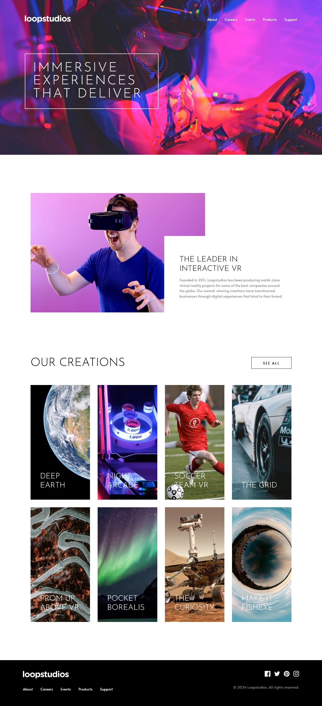

# Frontend Mentor - Loopstudios landing page solution

This is a solution to the [Loopstudios landing page challenge on Frontend Mentor](https://www.frontendmentor.io/challenges/loopstudios-landing-page-N88J5Onjw). Frontend Mentor challenges help you improve your coding skills by building realistic projects. 


## The challenge

Users should be able to:

- View the optimal layout for the site depending on their device's screen size
- See hover states for all interactive elements on the page

## Screenshot




## Links

- Solution URL: [solution](https://github.com/youssefKetata/Loopstudios-landing-page)
- Live Site URL: [site URL](https://vercel.com/youssefs-projects-998a6bb0/loopstudios-landing-page)


## Built with

- Semantic HTML5 markup
- CSS custom properties
- Flexbox
- CSS Grid
- Mobile-first workflow


## What I learned

```css
/* grid-row-start, grid-column-start, grid-row-end, and grid-column-end, respectively. */
selector {
    grid-area: 2/1/3/3  ;
}
```


## Author

- Frontend Mentor - [@youssefKetata](https://www.frontendmentor.io/profile/youssefKetata)
